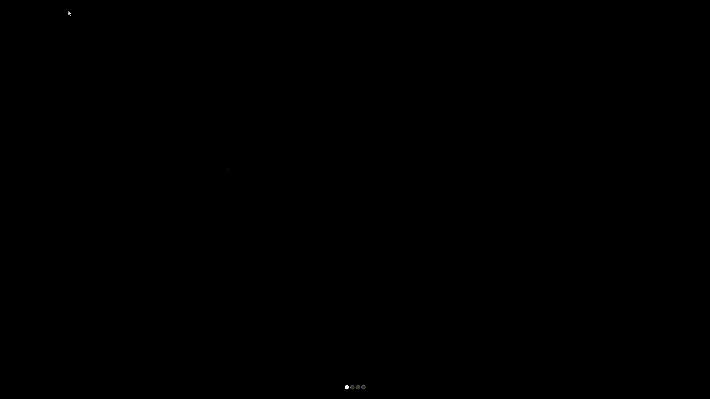

# MMM-Animation-MM
MMM-Animation-MM is a animation module for the [MagicMirror](https://github.com/MichMich/MagicMirror).
It is animation of Magic Mirror text on startup and can be triggered by notification from another module.



## Installation
```
cd ~/MagicMirror/modules
git clone https://github.com/englolo/MMM-Animation-MM.git
```
## Configuration


Add the following data to your config.js file
```
{
	module: "MMM-Animation-MM",
	position:"fullscreen_above",
}
```	
 config sample:
```
{
	module: "MMM-Animation-MM",
	position:"fullscreen_above",
	config:{
		animationSize: 70,
		animationStartDelay: 4,              
		animationNotificationDelay: 8,        
		notification: "SCREEN_ON",             
		notificationSender:"MMM-NewPir",      
		ignoreModules:["clock","alert"],        
		lockModule: true,                     
		}	
}		
```
### Configuration options:

| Option | Description | Type| Default |
|--------|---|---|---|
|```animationSize::```| The size of animation text between  0 and 80|number|```30```|
|```animationStartDelay:```| startup dalay in seconds| Number|```3```|
|```animationNotificationDelay:```|delay in seconds after notification is recived to delay animation(example: adding delay if screen wakeup| Number|```8```|
|```notificationSender:```| notificationSender (module name) to triger animation| String|```""```|
|```notification```| notification name to triger animation| String|```""```|
|```lockModule:```| hide all modules but ignore array list in ```ignoreModules:```| Bolean|```false```|
|```ignoreModules:```| A list of module names whom should not be hidden| Array list|```[]```|

## Note

- If at startup of MM is high load of resource, adding extra delay for animation in ```animationStartDelay:``` will help smoother experience.
- Second option is hide all modules with lockstring  ```lockModule:true```

## Change Log

### 2021-05-10 
- Rewrited code
- Added notificationReceived feature
- Added lock(hide) all modules feature 
- Added option for modules to be ignored 
- Added startup delay to triger animation
- Added delay to triger animation after notificationReceived 
- Added ability to change animation text size 
### 2021-01-30 initial demo
